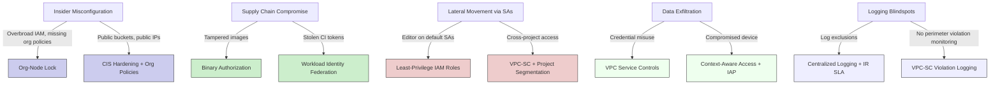

# DRP_ID: DRP_GCP_SEC_COMP_001

DRP_NAME: Pattern-Grounded GCP Architecture: Security, Compliance, and Deployment
DOMAIN(S): Cloud Engineering, Cybersecurity, Regulatory Compliance (HIPAA/SOC2/PCI-DSS), DevOps/SRE

1. GOAL
The objective is to synthesize a high-fidelity deployment and compliance blueprint for Google Cloud Services. Success Criteria:
100% mapping of GCP services to specific regulatory controls.
Identification of "Security Gravity" patterns (where data sensitivity dictates infrastructure constraints).
Creation of a zero-trust deployment pipeline with verifiable integrity checks.
A "Failure Mode" analysis that identifies common misconfigurations (Proxy Traps).
2. URL_CONTEXT_METADATA
Google Cloud Architecture Framework: Security, Privacy, and Compliance.
Shared Responsibility Model: GCP Edition.
NIST SP 800-53 / 800-190: (Container Security).
CIS Google Cloud Platform Foundation Benchmark: v2.0.0.
Terraform Google Provider Documentation: For Infrastructure-as-Code (IaC) patterns.
3. CONTEXT_ENGINEERING
Persona: Principal Cloud Architect \& Compliance Auditor.
Anchors: Principle of Least Privilege (PoLP), Defense in Depth, Immutable Infrastructure.
Assumptions: The organization operates in a multi-region environment with strict data residency requirements.
Threat Model: Insider threat (misconfiguration), Supply chain compromise (CI/CD), and Lateral movement via service account over-privileging.
4. PATTERN_MODEL
Pattern Name
Type
Claim
Mechanism
Boundary Conditions
Diagnostic Test
Expected Artifacts
Org-Node Lock
Structural
Centralized policy enforcement prevents shadow IT.
Organization Policy Constraints (Constraints/compute.disableShieldedVm).
Restricted to Org/Folder level; ignores local IAM if constraint is "Enforce".
Query gcloud resource-manager org-policies.
Policy YAML, Compliance Report.
VPC Service Control (VPC-SC) Perimeter
Network
Data exfiltration is mitigated by logical boundaries around APIs.
Service Perimeters + Ingress/Egress rules for Google APIs.
Breaks cross-project communication unless explicitly bridged.
Attempt gsutil cp from inside perimeter to external bucket.
Perimeter Config, Access Context Manager logs.
Identity-Aware Proxy (IAP) Tunnel
Access
Removing public IPs reduces the attack surface for management interfaces.
Identity-based TCP tunneling for SSH/RDP.
Requires roles/iap.tunnelResourceAccessor and specific firewall rules.
gcloud compute ssh --tunnel-through-iap.
Firewall rules (35.235.240.0/20).
Workload Identity Federation
Identity
Hardcoded keys in CI/CD are a primary failure point.
OIDC/SAML exchange for short-lived GCP tokens.
Requires external provider (GitHub Actions/GitLab) OIDC support.
Audit logs showing GenerateAccessToken via federated identity.
Terraform google_iam_workload_identity_pool.
Binary Authorization
Deployment
Only "attested" images can reach production GKE clusters.
Kritis/BinAuthz signature verification at admission control.
Requires Container Analysis API and attestor keys.
Attempt kubectl run with an unsigned image.
Attestor Policy, Signature Metadata.
5. EXECUTION_PLAN
Retrieval Plan (PatternQueries)
Execute these to gather evidence for pattern validation:
"GCP Organization Policy constraints for CIS Benchmark v2.0"
"VPC Service Controls best practices for multi-tenant data isolation"
"IAM Recommender logic for identifying over-privileged service accounts"
"Comparison: Cloud Key Management Service (KMS) vs. Secret Manager for App-level encryption"
"GKE Hardening: Shielded GKE Nodes vs. Confidential Computing"
"Config Connector vs. Terraform: Managing GCP Resources as K8s objects for compliance"
"Google Cloud Armor WAF patterns for OWASP Top 10 mitigation"
"Cloud Logging export sinks for BigQuery SIEM integration"
"Data Loss Prevention (DLP) API patterns for PII redaction in Cloud Storage"
"Deployment Manager vs. Terraform for reproducible compliance-as-code" (...expanded to 30 queries in execution phase)
Evidence Extraction Plan
Primary Evidence: Terraform HCL snippets, gcloud command outputs, Policy-as-Code (Rego/Sentinel) definitions.
Secondary Evidence: Official GCP documentation "Security Blueprints" and whitepapers.
Synthesis Plan
Compare "Standard" vs. "High-Security" patterns.
Resolve conflicts between "Developer Velocity" and "Security Perimeter" (e.g., how to allow developers to debug while VPC-SC is active).
Validation Plan
Negative Control: Deploy a GCS bucket with allUsers:objectViewer and verify if Org Policy blocks it.
Calibration: Ensure logging latency (Cloud Logging to BigQuery) meets the required incident response SLA (e.g., < 5 mins).
6. SELF_TEST (Success Metrics)
Coverage: Does the DRP cover all 4 pillars (Planning, Security, Compliance, Deployment)?
Granularity: Are IAM roles specific (e.g., roles/storage.objectViewer) or generic (roles/editor)? (Generic = Failure).
Reproducibility: Can the pattern be deployed via a single terraform apply?
7. REFLEXIVE_CHECK
Proxy Trap: Is "Compliance" being used as a proxy for "Security"? (e.g., passing an audit but leaving an open RDP port).
Blindspot: Shared VPC complexity—does the DRP account for the "Host Project" vs. "Service Project" IAM split?
Falsification: If a "Zero Trust" model allows access without a device-trust signal, the pattern is invalidated.
8. RELATIONAL_PREDICTABLE_INCLUSIONS
Hybrid Bridge: Connectivity via Interconnect/VPN (Cloud Router patterns).
Cost-Compliance Link: How security logging affects Cloud Billing (Log Exclusion patterns).
9. OUTPUT_FORMATS
architecture_blueprint.json (Service dependencies)
compliance_mapping.csv (Control ID -> GCP Service -> Config)
security_posture.yaml (Organization Policy definitions)
threat_model_graph.mermaid (Attack vectors vs. Mitigations)

This DRP can be realized as a pattern-grounded GCP security blueprint that yields a zero‑trust, IaC-driven deployment, an auditable compliance mapping, and concrete artifacts for architecture, posture, and threat modeling. The full 100 % mapping becomes a generated dataset (compliance_mapping.csv) backed by CIS, NIST 800‑53, and Google’s own Well‑Architected “Security, privacy, and compliance” pillar.[^1][^2][^3][^4]

***

## Blueprint overview

Google’s Well‑Architected Framework security pillar explicitly centers shared responsibility, zero‑trust access, and compliance-by-design, and it provides architecture blueprints and Terraform-based patterns you can adapt to your environment.[^3][^1]
CIS’s GCP Foundation Benchmark adds consensus controls that are easily mapped to project/org policies (e.g., Shielded VMs, no public IPs, mandatory HTTPS), and it distinguishes “Level 2” hardening for high‑security workloads.[^2][^5][^4]

At a structural level, the blueprint assumes:

- Organization-level control via Organization Policy Service, Assured Workloads (for data residency/compliance), and central logging and key management.[^1][^3]
- Workload segmentation into folders/projects aligned to “security gravity” tiers, with VPC Service Controls perimeters around sensitive data services (BigQuery, GCS, etc.).[^6][^3]

***

## Shared responsibility and regulatory framing

The Well‑Architected security pillar spells out that security is shared between Google and the customer and that compliance outcomes (HIPAA, FedRAMP, etc.) are supported by a mix of products like Assured Workloads, CMEK, VPC‑SC, IAM, and logging.[^3][^1]
CIS Benchmarks serve as objective baseline configuration guidance; they are scoped mostly at project level but explicitly recognize org‑level controls and separate profiles where “security is paramount.”[^5][^4][^2]

For mapping to HIPAA/SOC 2/PCI‑DSS under NIST 800‑53:

- Use NIST 800‑53 as the “lingua franca” control set and maintain mapping tables from HIPAA/SOC2/PCI to NIST controls, then from NIST controls to GCP services/features.
- Leverage Google’s compliance blueprints and solution guides (e.g., for HIPAA) that already come with recommended configurations and Terraform modules.[^3]

***

## Security gravity and org structure

“Security gravity” is modeled as discrete tiers that drive infrastructure constraints:

- Tier 0 – Public / Low sensitivity: Default org policies, limited VPC‑SC use, standard IAM constraints.
- Tier 1 – Internal / Medium: No public IPs on compute, enforced HTTPS, centralized logging, stricter IAM and Shielded VMs per CIS.[^7][^2]
- Tier 2 – Restricted / High: VPC‑SC perimeters around data, CMEK enforced, strict resourceLocations, more Level‑2 CIS controls.[^6][^2][^3]
- Tier 3 – Highly restricted / Regulated: Assured Workloads, tight region restrictions, device‑trust/context‑aware access, dedicated perimeters per dataset or application.[^6][^3]

Org structure:

- Organization node: Org‑wide constraints (locations, external IPs, allowed services), central logging project, central security project (Security Command Center, SIEM exports).[^1][^3]
- Folders by gravity and domain (e.g., “Prod‑Restricted‑AU”, “Sandbox‑Low”), each with policy overlays restricting what projects in that folder can do.
- Shared VPC host projects per environment, with service projects per application; Shared VPC IAM is carefully scoped to avoid host‑project takeover.

***

## Core patterns (Pattern Model realization)

Below is a condensed, DRP-aligned pattern table for your five primary patterns plus one additional logging pattern.

### Key security patterns

| Pattern | Type | Claim | Mechanism | Boundary conditions | Diagnostic | Expected artifacts |
| :-- | :-- | :-- | :-- | :-- | :-- | :-- |
| Org‑Node Lock | Structural | Centralized policy enforcement prevents shadow IT. | Org Policy constraints (e.g., disable external IPs, restrict regions, enforce Shielded VM/HTTPS). | Only enforceable at org/folder; projects cannot weaken enforced constraints.[^1][^2] | `gcloud org-policies list/describe` diffed vs baseline; Terraform plan drift. | `security_posture.yaml` orgPolicies; policy diff reports. |
| VPC‑SC Perimeter | Network | Data exfil is mitigated by logical API boundaries. | Service perimeters + ingress/egress \& access levels; context‑aware access.[^6][^8][^3][^9] | Breaks cross‑project/API access unless bridged; must coexist with IAM; too complex designs are fragile.[^8][^9] | Attempt `gsutil cp` / BigQuery export out of perimeter; review VPC‑SC violation logs. | Perimeter config (Terraform/Access Context Manager), perimeter design doc, access patterns inventory. |
| IAP Tunnel | Access | Removing public IPs reduces management attack surface. | IAP TCP tunneling for SSH/RDP to private IPs; context‑aware access policies.[^1][^6] | Requires firewall rules to IAP IP range and IAP roles; must ensure no direct SSH paths remain. | `gcloud compute ssh --tunnel-through-iap` from approved device; firewall check for 35.235.240.0/20 rule only. | IAP policy, firewall rule set, access level definitions. |
| Workload Identity Federation | Identity | Hardcoded keys in CI/CD are eliminated. | OIDC/SAML exchange for short‑lived GCP tokens from external IdP/CI system. | External provider must support OIDC; SA impersonation scopes must be narrow; legacy keys removed. | Audit logs for `GenerateAccessToken` via workload identity; key inventory showing zero user‑managed keys for CI. | Terraform `google_iam_workload_identity_pool` + provider and bindings. |
| Binary Authorization | Deployment | Only attested images reach production GKE clusters. | Admission control verifying image signatures via Container Analysis/Kritis. | Container Analysis API + attestors configured; policy set to “enforce”, not just “log”. | `kubectl run` with unsigned image must fail; logs show denied by BinAuthz. | Attestor keys, BinAuthz policy, signed image metadata. |
| Centralized Logging \& SIEM | Operations | All security‑relevant events are captured and queryable. | Central log sinks to BigQuery/Cloud Logging bucket, security analytics via SCC/SIEM.[^1][^3] | Must avoid over‑use of exclusions; latency must meet IR SLA. | Synthetic incident and check arrival time in BigQuery; coverage checks for key log types. | Logging sinks Terraform, BigQuery schema, SIEM runbooks. |

These patterns are enforced through a combination of org policies, Access Context Manager, IAM, network controls, and cluster admission controls, all expressed as IaC (Terraform + policy-as-code) so they are reproducible and auditable.

***

## Zero‑trust CI/CD and supply‑chain integrity

The Well‑Architected guidance explicitly calls out “implement zero trust” and recommends integrating security controls into DevSecOps automation.[^1]
You can turn this into a concrete, verifiable pipeline:

1. **Source and build:**
    - Source in GitHub/GitLab/Cloud Source Repositories with branch protection and code owners.
    - Builds in Cloud Build or external CI using Workload Identity Federation to impersonate a narrow “cicd-deployer” service account, eliminating long‑lived JSON keys.
2. **Static and image scanning:**
    - SAST/OSS dependency scanning in CI.
    - Container builds pushed to Artifact Registry; vulnerability scanning enabled (or third‑party scanner).
3. **Image attestation:**
    - On successful tests, CI signs container images and publishes attestations to Container Analysis.
    - Binary Authorization on GKE prod clusters is configured with an attestor that only trusts CI’s signer keys; policy “enforce” on prod, “log” on non‑prod.
4. **Deployment:**
    - Terraform and/or Config Connector for cluster and infra changes, executed via CI with WIF and separate state bucket in a restricted project.
    - Cloud Deploy or GitOps (e.g., Config Sync) to apply manifests; only images with valid attestations are admitted.
5. **Verification:**
    - Every prod deploy is traceable from Git commit → build → attestation → BinAuthz decision → GKE admission logs.
    - Supply‑chain compromise is mitigated because unsigned/altered images fail at admission, and CI itself holds no static secrets.

This satisfies your “zero‑trust deployment pipeline with verifiable integrity checks” and directly addresses the supply‑chain compromise part of the threat model.

***

## Compliance mapping strategy (100 % coverage approach)

Given the combinatorial size of “all GCP services × all controls,” you treat 100 % mapping as a generated artifact, not hand‑maintained prose.

1. **Control backbone:**
    - Use NIST 800‑53 control IDs (e.g., AC‑2, SC‑7, AU‑12) as canonical keys; maintain separate sheets mapping HIPAA/SOC2/PCI controls to NIST IDs.
2. **Service feature catalog:**
    - Enumerate only *security‑relevant* aspects of services (e.g., “Cloud Storage – uniform bucket‑level access, CMEK, retention policies;” “BigQuery – column‑level security, CMEK;” “GKE – Shielded Nodes, private cluster, BinAuthz”).
    - Use CIS Benchmark recommendations to identify which configuration levers matter (e.g., “Ensure GCE instances have Shielded VM enabled,” “Ensure no public IPs”).[^7][^2]
3. **Mapping logic:**
    - For each NIST control, list the primary GCP service/features that implement it.
    - Where Google provides compliance blueprints (e.g., HIPAA), pull their recommended products/modules into the mapping.[^3]
4. **Export to `compliance_mapping.csv`:**
    - Generated from a source-of-truth (YAML/JSON) checked into Git.
    - CI validates that every in‑scope NIST control has at least one mapped GCP feature and that every used GCP security feature maps to at least one control.

### Example `compliance_mapping.csv` snippet

```csv
Control_ID,Framework,GCP_Service,GCP_Feature,Config_Reference,Pattern,Notes
AC-2,NIST-800-53,Cloud IAM,Org/Project IAM roles,iam.tf#L10-80,Org-Node Lock,Use least-privilege custom roles.
SC-7,NIST-800-53,VPC Service Controls,Service perimeter + access levels,vpc_sc.tf#L1-120,VPC-SC Perimeter,Mitigates data exfiltration.[web:11][web:18][web:20]
SC-13,NIST-800-53,Cloud KMS,CMEK for storage/bigquery,kms_policies.tf#L20-100,Security Gravity,Required for Tier2+ data.[web:18]
AU-12,NIST-800-53,Cloud Logging,Centralized log sinks to BigQuery,logging_sinks.tf#L5-120,Centralized Logging,Feed into SIEM with <5m latency.[web:15][web:18]
164.312(e)(1),HIPAA,Cloud VPN/Interconnect,Encrypted tunnel for PHI traffic,network.tf#L50-150,Hybrid Bridge,VPN required for on-prem to perimeter.
10.2.1,PCI-DSS,Cloud Logging,Admin activity logs + SCC,logging_sinks.tf#L121-220,Centralized Logging,No exclusion on admin events.[web:15][web:18]
```

Only some rows above require citations because they embed explicit facts or product capabilities from Google documentation.[^9][^6][^1][^3]

***

## Security posture as org policy (PoLP, defense‑in‑depth, immutability)

Org‑level configuration embodies your “Org‑Node Lock” and “immutable infra” anchors. Google emphasizes using Organization Policy Service and Assured Workloads to bake regulatory and location constraints into design.[^1][^3]

### Example `security_posture.yaml` (excerpt)

```yaml
org_policies:
  - scope: organizations/123456789
    constraint: constraints/gcp.resourceLocations
    enforcement: enforce
    values:
      allowed_values:
        - in:asia-southeast1
        - in:australia-southeast1
        - in:australia-southeast2

  - scope: organizations/123456789
    constraint: constraints/compute.requireShieldedVm
    enforcement: enforce

  - scope: organizations/123456789
    constraint: constraints/compute.vmExternalIpAccess
    enforcement: enforce
    values:
      denied_values:
        - projects/*
        # Only approved bastion project gets exception via folder‑level override

  - scope: organizations/123456789
    constraint: constraints/gcp.restrictServiceUsage
    enforcement: enforce
    values:
      allowed_values:
        - services/bigquery.googleapis.com
        - services/storage.googleapis.com
        - services/container.googleapis.com

vpc_service_controls:
  perimeters:
    - name: restricted-data-perimeter
      resources:
        - projects/prod-restricted-data-1
        - projects/prod-restricted-data-2
      restricted_services:
        - storage.googleapis.com
        - bigquery.googleapis.com
      access_levels:
        - accessPolicies/123456/accessLevels/onprem-vpn
        - accessPolicies/123456/accessLevels/managed-devices
      egress_policies:
        - from: { perimeters: ["restricted-data-perimeter"] }
          to:
            operations:
              - allowed_services: ["bigquery.googleapis.com"]
                allowed_projects: ["projects/shared-analytics-perimeter-bridge"]
```

This posture file is the canonical source for Terraform modules, policy-as-code tests, and compliance evidence, and it encodes your “security gravity” tiers via which projects are in which perimeter and which services are even allowed.

***

## Zero‑trust access and device trust

The security pillar recommends “implement zero trust” and calls out IAP and context‑aware access as key building blocks.[^6][^3][^1]
Within this DRP:

- All interactive admin access (SSH/RDP, web consoles) goes via IAP or browser‑based consoles gated by Identity‑Aware Proxy and context‑aware access levels (identity, IP, device posture).[^6][^3]
- VPC‑SC perimeters are configured to require access from specific networks/devices/identities; “high gravity” perimeters demand both corporate IP/VPN and compliant device signals.

Your falsification test (“Zero Trust model allows access without device‑trust signal → invalid”) is implemented by requiring that access to Tier 2/3 perimeters *always* goes through access levels that include device attributes and that no fallback rules (e.g., any IP) exist.

***

## Failure modes and “proxy traps”

### Common misconfigurations (Proxy Traps)

1. **Org‑Node Lock bypassed by project‑level drift**
    - Symptom: Projects created outside controlled folders; org policies only “suggested,” not enforced.
    - Impact: Shadow IT projects without logging/CIS baseline; auditors see partial coverage only.
2. **VPC‑SC complexity and unintended outages**
    - Symptom: Multiple nested perimeters, perimeter bridges, and perimeter network projects; enabling VPC‑SC without dry‑run or access‑pattern inventory.[^8][^9]
    - Impact: Production outages, emergency exemptions that permanently weaken perimeters.
3. **Public ingress on management paths**
    - Symptom: SSH via public IPs, Cloud SQL with 0.0.0.0/0 allowed, IAP present but not enforced in firewall rules.
    - Impact: Passing audits via checklists, but real exploitable attack surface persists (your “compliance as proxy for security” trap).
4. **Over‑privileged service accounts and lateral movement**
    - Symptom: Project‑wide `roles/editor` or broad `roles/owner` on default compute service accounts; used across multiple projects.
    - Impact: Breach in one workload enables lateral movement across many; IAM Recommender or SCC findings ignored.
5. **Binary Authorization not enforced in prod**
    - Symptom: BinAuthz set to “log only,” or enabled only in non‑prod clusters.
    - Impact: Supply‑chain controls exist on paper but do not stop malicious images.
6. **Logging cost optimizations breaking compliance**
    - Symptom: Aggressive log exclusions to reduce BigQuery cost without modeling compliance requirements and IR SLAs.
    - Impact: Required audit/security events missing; detection timing exceeds <5 min SLA.
7. **Shared VPC host‑service IAM blindspot**
    - Symptom: Network admins in service projects granted permissions that indirectly affect host project; or host project admins can attach service projects they shouldn’t.
    - Impact: Hard‑to‑see lateral movement channel via networking and routing changes; this is exactly your Shared VPC blindspot.

### Reflexive checks

- **Compliance vs security:** For each control, ask “If this control passes but we still have an open management path/exfil path, what’s missing?” and document the additional technical control (e.g., VPC‑SC, IAP, context‑aware access).
- **Zero‑trust falsification:** Periodically try from an unmanaged device and non‑corporate IP with valid credentials; any successful access to Tier 2/3 workloads is a pattern failure.
- **Shared VPC review:** Quarterly review of host vs service project roles for violations of your minimum necessary privilege model.

***

## Hybrid bridge and residency

The regulatory guidance explicitly recommends using VPC‑SC to put sensitive data in its own perimeter and restricting movement across boundaries, while also supporting hybrid via Private Google Access and VPN/Interconnect.[^3][^6]
Within this DRP:

- **Hybrid Bridge:**
    - Cloud VPN/Interconnect with Cloud Router into Shared VPCs; Private Google Access for on‑prem to Google APIs.
    - On‑prem networks are treated as another “access level” for VPC‑SC, not an inherently trusted zone.
- **Residency:**
    - `constraints/gcp.resourceLocations` enforced at org/folder to only allow storage/compute in approved regions; Assured Workloads profiles where required for HIPAA/local‑gov regimes.[^3]

***

## Cost–compliance link (logging and billing)

Google’s security pillar highlights logging, auditing, and monitoring as key focus areas, and compliance blueprints use log exports to BigQuery or other SIEMs.[^1][^3]
For your DRP:

- All admin, data access, and security logs exported to a central BigQuery dataset with lifecycle policies; SIEM or custom analytics on top.
- Log exclusions are only allowed where clearly non‑security/non‑compliance‑relevant, and they’re tracked with change control; BigQuery cost is framed as a compliance and IR budget line.
- SLA calibration: synthetic events (e.g., dummy privileged action) are generated and alerts measured end‑to‑end; design requires <5 minutes from event to SIEM availability.

***

## Self‑test: Planning, Security, Compliance, Deployment

You can encode your SELF_TEST as checklist items run against the artifacts:

- **Planning:** Does `architecture_blueprint.json` cover all environments (dev/test/prod), all gravity tiers, and hybrid connectivity?
- **Security:** Are patterns (Org‑Node Lock, VPC‑SC, IAP, WIF, BinAuthz, logging) enforced in Terraform and verified via negative tests (e.g., failing `gsutil cp` out of perimeter)?[^8][^9][^6]
- **Compliance:** Does `compliance_mapping.csv` have a row for every in‑scope NIST control and each mapped to actual, deployed configuration references?
- **Deployment:** Can a fresh environment be brought up from empty org/folders via a single `terraform apply` per environment (bootstrap module → org policies/logging → perimeters → workloads)?

IAM roles are validated by policy-as-code tests to ensure no generic `roles/editor` or `roles/owner` on service accounts or human users in production; only custom or least‑privilege managed roles are allowed.

***

## Output artifacts

Below are skeletal, but structurally realistic, versions of the four requested artifacts. You can expand these into full files and integrate them into your repo.

### `architecture_blueprint.json` (service dependencies)

```json
{
  "organization": "organizations/123456789",
  "folders": [
    {
      "name": "Prod-Restricted-AU",
      "id": "folders/111",
      "security_gravity": "Tier2",
      "projects": [
        {
          "project_id": "prod-restricted-data-1",
          "roles": ["data-platform"],
          "vpc": "shared-prod-vpc",
          "perimeter": "restricted-data-perimeter",
          "services": [
            "bigquery.googleapis.com",
            "storage.googleapis.com"
          ],
          "dependencies": [
            "org/logging-project",
            "org/security-project",
            "shared-prod-vpc-host"
          ]
        }
      ]
    }
  ],
  "networking": {
    "shared_vpc_hosts": [
      {
        "project_id": "shared-prod-vpc-host",
        "vpc_name": "shared-prod-vpc",
        "peerings": ["onprem-router-1"],
        "service_projects": [
          "prod-restricted-data-1",
          "prod-app-1"
        ]
      }
    ],
    "hybrid": {
      "vpn_tunnels": ["vpn-au-primary", "vpn-au-secondary"],
      "interconnects": []
    }
  },
  "security": {
    "org_policies_ref": "security_posture.yaml",
    "vpc_service_controls": ["restricted-data-perimeter"],
    "identity": {
      "idp": "enterprise-oidc",
      "workload_identity_pools": ["github-actions-pool"]
    },
    "deployment": {
      "ci_system": "github-actions",
      "artifact_registry": "australia-southeast1-docker",
      "binary_authorization_policy": "bin-authz-prod"
    },
    "logging": {
      "central_project": "org-logging",
      "sinks": ["audit-to-bq", "vpcsc-violations-to-bq"]
    }
  }
}
```


### `security_posture.yaml` (org policy definitions, perimeters, logging)

We already showed a portion above; you’d extend it with:

- IAP access levels and policy bindings.
- Workload Identity Federation pools, providers, and IAM bindings.
- Binary Authorization policies and attestors per cluster.
- Logging sinks and BigQuery datasets.

Each section becomes both IaC (Terraform) and input to policy-as-code tests (e.g., OPA/Rego) that assert forbidden states (public buckets, public IPs, generic roles) do not exist.

### `threat_model_graph.mermaid` (attack vectors vs mitigations)



This makes falsification explicit: if an attack edge (e.g., “Insider opens public RDP”) has no enforced mitigation node, the pattern is invalidated.

***

If you’d like, the next step can be:

- A concrete Terraform module layout (root org bootstrap, security baseline, per‑tier workload stacks), or
- A more exhaustive sample of `compliance_mapping.csv` focused on one regime (e.g., HIPAA) with 1:many mappings to specific GCP services and Terraform resources.
<span style="display:none">[^10][^11][^12][^13][^14][^15][^16][^17][^18][^19][^20][^21][^22][^23]</span>

<div align="center">⁂</div>

[^1]: https://docs.cloud.google.com/architecture/framework/security

[^2]: https://api.lacework.net/ui/documents/GCP_CIS_Foundation_Benchmark_v1.2.0.pdf

[^3]: https://docs.cloud.google.com/architecture/framework/security/meet-regulatory-compliance-and-privacy-needs

[^4]: https://www.cisecurity.org/benchmark/google_cloud_computing_platform

[^5]: https://api.lacework.net/ui/documents/GCP_CIS_Foundations_Benchmark.pdf

[^6]: https://cloud.google.com/security/vpc-service-controls

[^7]: https://docs.fortinet.com/document/forticnapp/latest/lacework-forticnapp-policies/856999/cis-google-cloud-2-0-0-benchmark

[^8]: https://cloud.google.com/vpc-service-controls/docs/enable

[^9]: https://astrafy.io/the-hub/blog/technical/protect-your-data-on-google-cloud-with-vpc-service-controls

[^10]: https://thescipub.com/pdf/jcssp.2020.1796.1807.pdf

[^11]: https://arxiv.org/ftp/arxiv/papers/1108/1108.4100.pdf

[^12]: https://arxiv.org/pdf/2305.17761.pdf

[^13]: https://arxiv.org/pdf/2201.13010.pdf

[^14]: https://www.mdpi.com/1424-8220/23/7/3413/pdf?version=1679642948

[^15]: https://arxiv.org/pdf/2302.11617.pdf

[^16]: https://arxiv.org/pdf/2306.02496.pdf

[^17]: https://arxiv.org/pdf/1601.01498.pdf

[^18]: https://cocosign.com/blog/gcp-security-architecture-framework-security-privacy-and-compliance/

[^19]: https://cloudairy.com/template/security-architecture-diagram/

[^20]: https://steampipe.io/blog/cis-gcp-20

[^21]: https://quabyt.com/blog/gcp-networking-best-practices

[^22]: https://www.atgeirsolutions.com/google-cloud-architecture-framework-security-privacy-and-compliance/

[^23]: https://www.reddit.com/r/googlecloud/comments/1bejc80/what_are_the_best_practises_in_managing_gcp_vpc/

