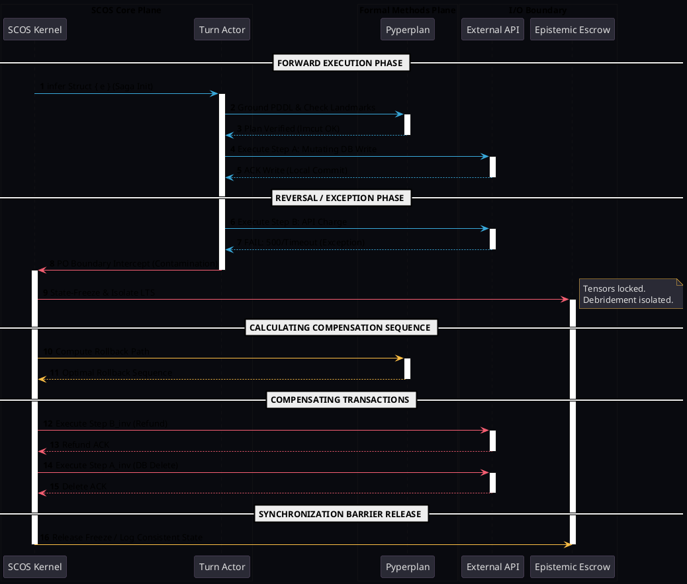
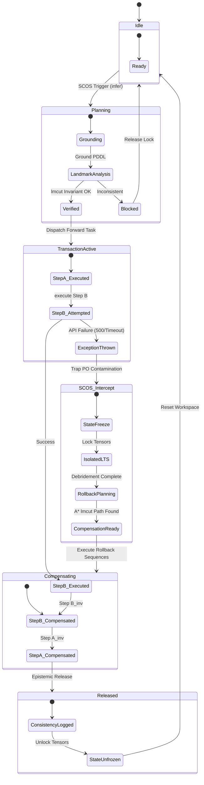
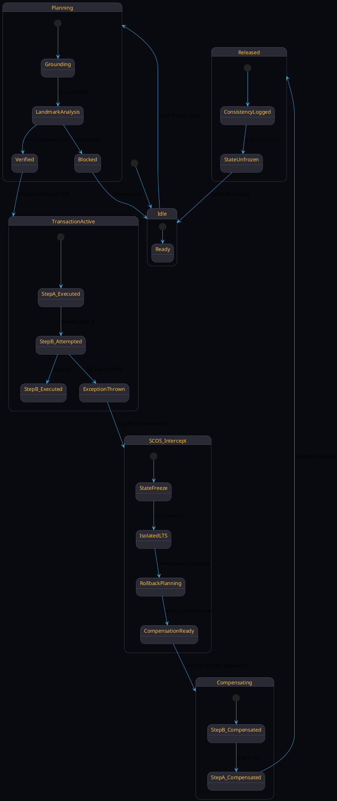

# SCOS-Saga: Unified Saga Transaction Rollback & State-Space Specifications

This document defines the formal, deterministic specifications for SCOS-Saga transaction orchestrations. It includes the structural layout of state machines and execution sequences designed to handle distributed, non-monotonic failures over external web ledgers without context window contamination or attention state tearing.

---

## 1. Architectural & Theoretical Mapping

The SCOS-Saga orchestration layer resolves the **"Lost Compensation Problem"** by separating the forward transaction planning domain from the transactional recovery domain. 
*   **Forward Path ($\mathcal{T}_{\text{fwd}}$)**: Represented as a Directed Acyclic Graph (DAG) with explicit success contracts ($\kappa_v$).
*   **Backward Path ($\mathcal{T}_{\text{comp}}$)**: Programmatically verified using Pyperplan's $A^*$ algorithm under the Landmark-cut (`lmcut`) heuristic *before* dispatching any rollbacks.
*   **Boundary Control**: Regulated via **Region Connection Calculus (RCC-8)** constraints to prevent noisy, unstructured Dead Letter Queue (DLQ) traceback strings from partially overlapping (PO) and contaminating the agent's P1 Working Memory space.

---

## 2. Mermaid.js Sequence Diagram Specification

```mermaid
sequenceDiagram
    autonumber
    box DarkSlate SCOS Core Plane
    actor SCOS as SCOS Kernel
    actor Actor as Turn Actor
    end
    box LightSlate Formal Methods Plane
    actor Planner as Pyperplan Model Checker
    end
    box DarkSlate I/O Boundary
    actor API as External Service
    actor Escrow as Epistemic Escrow
    end

    Note over SCOS, API: --- FORWARD EXECUTION PHASE ---
    SCOS->>Actor: infer Struct { e } (Saga Init)
    activate Actor
    Actor->>Planner: Ground PDDL & Check Landmarks
    activate Planner
    Planner-->>Actor: Plan Verified (lmcut Invariant Checked)
    deactivate Planner
    Actor->>API: Execute Step A: Mutating DB Write
    activate API
    API-->>Actor: ACK Write (Step A Committed locally)
    deactivate API
    
    Note over SCOS, API: --- REVERSAL / EXCEPTION PHASE ---
    Actor->>API: Execute Step B: API Charge
    activate API
    API-->>Actor: FAIL: 500/Timeout (Exception thrown)
    deactivate API
    Actor->>SCOS: PO Boundary Intercept (Exception Leaked)
    deactivate Actor
    activate SCOS
    SCOS->>Escrow: Execute State-Freeze & Isolate LTS Tensors
    activate Escrow
    Note right of Escrow: Tensors locked.<br/>Debridement isolated.
    
    Note over SCOS, API: --- CALCULATING OPTIMAL COMPENSATING SEQUENCE ---
    SCOS->>Planner: Compute Rollback Path (lmcut over current state)
    activate Planner
    Planner-->>SCOS: Optimal Rollback Sequence Found
    deactivate Planner
    
    Note over SCOS, API: --- COMPENSATING TRANSACTIONS ---
    SCOS->>API: Execute Step B_inv (Refund Charge)
    activate API
    API-->>SCOS: Refund ACK
    deactivate API
    SCOS->>API: Execute Step A_inv (DB Delete)
    activate API
    API-->>SCOS: Delete ACK
    deactivate API
    
    Note over SCOS, API: --- SYNCHRONIZATION BARRIER RELEASE ---
    SCOS->>Escrow: Release Freeze / Log Consistent Neutral State
    deactivate Escrow
    deactivate SCOS
```

---

## 3. PlantUML Sequence Diagram Specification



---

## 4. Mermaid.js UML Statechart Specification



---

## 5. PlantUML UML Statechart Specification



---

## 6. Mathematical Transition & Verification Logic

Let the transition system be modeled as a Labeled Transition System (LTS):
$$\mathcal{M} = (\Sigma, Act, \to, P_0)$$

For any failure state $s_f \in \Sigma$ triggered by an external API violation, SCOS ensures absolute state liveness by proving:
1.  **Safety ($\square \neg \text{PO\_Contamination}$)**: Formally checked via LOTOS model gates.
2.  **Liveness ($\diamond \text{Consistent\_State}$)**: Guaranteed because the Paige-Tarjan three-way split maps the error boundary preimage $E^{-1}(B)$ onto the isolated, non-looping block $S_3$, triggering $A^*$ landmarks extraction.
