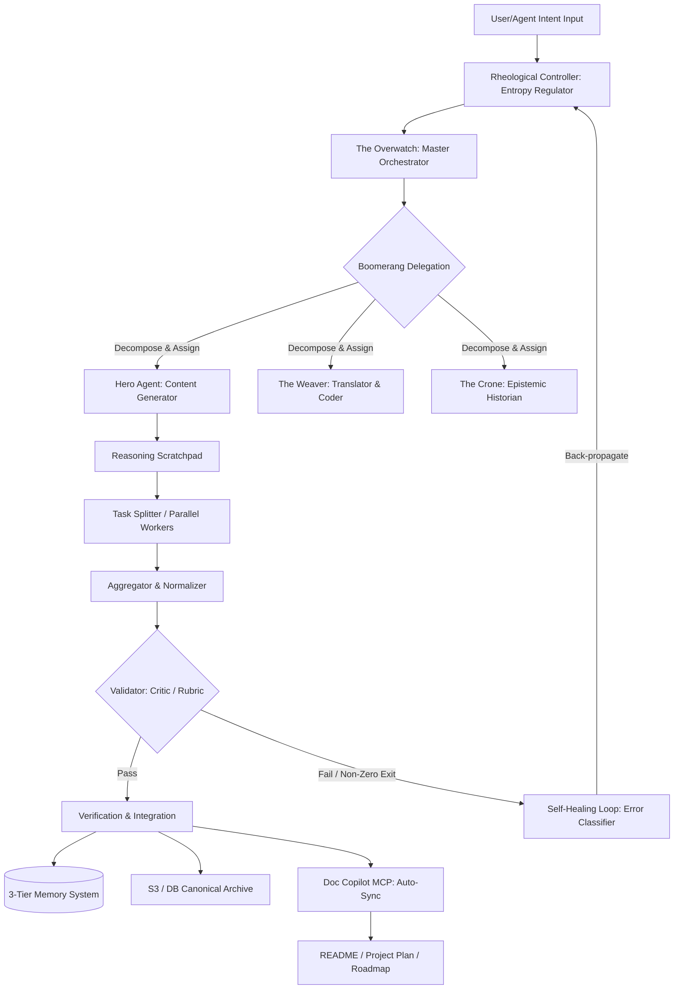

### [MACRO-OUTPUT ARCHITECTURE: THE THREE CONTENT GENERATION PILLARS]

The "Deeper Research Synthetic" ecosystem operates a multi-channel generative engine designed to produce highly detailed, evidence-based, and auditable outputs. This content layer serves as a direct antidote to low-effort "AI slop" by enforcing rigorous, user-calibrated learning loops. The system's output is structured and deployed through **three core content generation frameworks**:

#### 1. The Deeper Research Framework (Output Codeword: **TOME**)
*   **Purpose & Design**: Formulated to produce **exhaustive, academic-style white papers**. It serves as a tool for deep conceptual synthesis, combining extensive literature reviews, comparative market analysis, and multi-perspective strategic modeling.
*   **Systemic Mechanism**: This framework translates raw context source files into highly detailed, deeply analyzed specifications. It utilizes a **Scratchpad Framework** to ensure cognitive transparency, forcing the generating agent to verbalize its thought process, plan, execute, and self-review before committing to the final text. 

#### 2. The Podcast Synthetic Framework (Output Codeword: **TRANSMISSION**)
*   **Purpose & Design**: Engineered for **compelling, narrative-driven, multi-turn audio episodes**. It transitions complex or unstructured research material into engaging, human-centric spoken narratives.
*   **Systemic Mechanism**: Driven by the `podcast_mcp` and associated agent scripts, this framework structures raw information into sequential narrative beats, character/speaker turn allocations, audio asset cue sheets, and eventually full, text-to-speech (TTS)-ready written scripts. It then compiles the audio files and automatically generates corresponding written transcripts to preserve referential and search index integrity.

#### 3. The Human Condition Benchmark (HCB) Framework (Output Codeword: **SNAPSHOT**)
*   **Purpose & Design**: Optimized for **data-driven, infographic-rich crisis dashboards**. It provides immediate, high-fidelity visual representations of complex systems, global risk vectors, and KPI metrics.
*   **Systemic Mechanism**: This framework aggregates raw transactional data or streaming telemetry, evaluates it against predefined validation schemas, and compiles it into visual charts (lines, bars, distributions, and relationship scatter plots). These are integrated into live frontend dashboards alongside alert mechanisms (e.g., DEFCON-style status changes) and clear citation matrices.

---

### [REVERSE-ENGINEERING THE SYSTEMATIC "AI HARNESS" SPECIFICATION]

To dynamically execute these three content pipelines without manual intervention, human error, or drift, the ecosystem relies on an advanced, automated **AI Harness**. Operating as the CVO, CFO, and Acting CEO of this initiative, I have reverse-engineered the system requirements for a production-grade orchestration engine. 

This harness operates strictly under **The Mold Paradigm**. Value is systematically migrated away from the hand-carved code or content (the "disposable artifact") to the **Mold** (the structured prompts representing intent, and the dense test suites representing invariants). 

Here is the structured systems engineering specification for the inferred harness, modeled across **The Four Pillars of Specification Planning**:



---

### [THE FOUR PILLARS OF HARNESS SPECIFICATION PLANNING]

#### Pillar 1: Automated Discovery and Constraint Mining (Invariants vs. Soft Targets)
The harness operates within a high-integrity execution environment where constraints are not merely guidelines, but structural walls.

##### A. Hard Boundaries (Invariants)
*   **The Lexical Casing Hierarchy**: Force-enforced naming conventions to maintain semantic and round-trip conversion integrity across 24+ formats:
    *   `PascalCase` is strictly reserved for UI/React components.
    *   `camelCase` is mandated for hooks, functions, and services.
    *   `kebab-case` is required for file names, directories, and AI agent identifiers.
    *   `UPPER_SNAKE_CASE` is exclusive to constants and environment variables.
*   **The Non-Zero Exit Rule**: In any program-of-thoughts or tool-chain execution, if a subprocess results in a non-zero exit code, it must not fail silently. It must insert a bracketed error block to immediately alert the orchestrator for triage.
*   **Security Sanitization Shields**: All dynamic inputs must pass through dedicated pre-execution input filters (e.g., `DOMPurify` to mitigate XSS in custom AI configurations) and strict permitted-tool lists.

##### B. Soft Targets (Optimizable Goals)
*   **Context Window Optimization**: Maintain active session context under **40% utilization** at all times. 
*   **Token Diet Protocol**: Use **Progressive Context Disclosure** (loading detailed `SKILL.md` procedural files or resource datasets only on-demand via metadata indexing) to prevent "Context Cannibalization".

---

#### Pillar 2: Isomorphic Formalization (From Abstract Schema to Executable Contracts)
To guarantee that intent compiles cleanly into outputs, abstract structural archetypes are bound to testable machine schemas:

| System Layer | Abstract Design Pattern | Isomorphic Component / Tool Contract | Verification Metric |
| :--- | :--- | :--- | :--- |
| **Orchestration** | **Boomerang Delegation** | Centralized orchestrator spawns subagents, passes localized context, and mandates a verification return. | Binary status verification of `STATE-OF-THE-PROJECT.md` or `spec.json` approvals. |
| **Sequential Processing** | **Prompt Chaining** | Orchestrator → Agent Module (Step N) → Validator Check. | Strict JSON schema compliance and PII-redaction filters. |
| **High-Throughput** | **Parallelization** | Task Splitter divides monolithic input → N Worker Agents run concurrently → Aggregator normalizes. | 100% thread isolation; write/edit operations restricted to sequential locks to prevent shared state conflicts. |
| **Quality Control** | **Reflection Loop** | Generator Agent drafts → Critic Agent reviews against Rubric → Revision Loop executes. | Rubric score threshold (e.g., $\ge 90\%$) or $Max\_Revisions = 3$ hit. |
| **Memory** | **3-Tier Memory** | Semantic Vector Search (fuzzy context) + Append-Only Audit Log + Versioned Snapshots. | Query retrieval latency $< 500\text{ms}$; exact cryptographic hash matching for historical states. |
| **Requirements** | **EARS Syntax** | "When [Condition], if [Precondition], the [System] shall [Action]". | 100% test-to-requirement coverage mapping; automatic compilation to failing TDD tests. |

---

#### Pillar 3: Parametric Trade-off Modeling (The Feasibility Frontier)
In a production-grade AI harness, pushing for maximum analytical depth creates direct tension with computational latency, token budgets, and API costs. To address this, the harness runs a **Complexity Classifier** to optimize the "Feasibility Frontier":

$$\text{Optimization Target} = \min \left( \text{Token Cost} \times \text{Latency} \right) \quad \text{subject to} \quad \text{Quality} \ge \text{Threshold}$$

*   **Model Routing Strategy**:
    *   **High-Volume, Low-Complexity Tasks** (e.g., syntax checks, initial directory sweeps, formatting, parallel worker tasks): Routed to cheaper, fast models (e.g., `gemini-2.5-flash` or `haiku`).
    *   **High-Complexity, High-Stakes Tasks** (e.g., system architecture, critical security auditing, final report synthesis): Routed to state-of-the-art reasoning engines (e.g., `gemini-2.0-flash-thinking`, `gpt-5.2-thinking`, or `opus`).
*   **The "Thinking Budget" Trade-off**:
    *   For interactive visual tweaks or styling fixes, the harness bypasses expensive planning steps by explicitly instructing the agent: *"Do not plan. Do not reflect. Just execute"*. This optimizes the context window and reduces latency.
    *   For structural changes, deep reasoning is enabled by omitting limits on output tokens, allowing the model to leverage its hidden chain-of-thought.

---

#### Pillar 4: Continuous Falsification & Edge-Case Stress Testing
Before the harness commits or executes, it must simulate failure modes to prevent systematic errors:

*   **Edge Case: "The False Finish"** (The behavioral anomaly where an agent marks a task "Complete" in documentation while the actual system remains broken).
    *   *Harness Mitigation*: The **Evidence-First/Traceability Pattern**. No task is accepted as complete without an accompanying raw execution log, a passing test suite run, and verifiable output files written to disk.
*   **Edge Case: "Implicit/Hidden State"** (The pipeline relies on hidden, untracked environmental variables, leading to non-deterministic crashes).
    *   *Harness Mitigation*: The **Stateless Toolcall Policy**. Every tool execution must explicitly define its input arguments, context payloads, and dependencies within the JSON schema.
*   **Edge Case: "Silent Gap Filling"** (The model encounters missing information and "smooths over" the gap by hallucinating details to present a complete-looking framework).
    *   *Harness Mitigation*: Mandatory **Uncertainty Quantification**. If required data is missing, the generator must output explicit placeholders (e.g., `<metric_placeholder>`) and categorize the missing information in a structured "Gap Registry".

---

### [METHOD OF EXPLORATION: SPECIFICATION FEASIBILITY SIMULATING]

To validate this harness under real-world deployment conditions, we simulate a **Multi-Channel Pipeline Run**:

1.  **Intent Seed Ingestion**: The system receives a raw product brief (e.g., *"Create an automated geopolitical risk dashboard"*).
2.  **Decomposition & Task Mapping**: The `Orchestrator` uses **Boomerang Delegation** to divide the project into parallel workstreams. It writes an initial Work Order to `.dev/ai/workorders/`.
3.  **Parallel Execution**:
    *   **Worker 1 (Research Specialist)**: Scans context files using semantic search and extracts raw historical data.
    *   **Worker 2 (System Designer)**: Designs the database schemas and API specifications, translating intent into EARS-compliant requirements.
4.  **Verification and Quality Gate**:
    *   The draft design is routed to the `Critic Agent`.
    *   It detects a security risk: the API configuration contains hardcoded credentials.
    *   The `Critic` rejects the draft, applying a negative score and outputting actionable feedback.
5.  **Self-Healing & Back-Propagation**:
    *   The `Generator` captures the error, re-routes database credentials to GSM/environment variables, updates the parent prompt, and regenerates the clean code block.
6.  **Ecosystem Synchronization**:
    *   The successful output is written to the PostgreSQL/pgvector S3 archive.
    *   The `Doc Copilot MCP` is triggered. It parses the repository, calculates the delta, and automatically updates `/README.md` and `/project-plan.md` to reference the newly generated dashboard, ensuring zero document drift.

---

### [FINALIZED HARNESS RESEARCH PROMPTS]

These three highly rigorous, non-obvious research prompts are derived from the corpus of architectural, agentic, and specification design patterns discovered in this ecosystem. They are structured for direct ingestion by advanced reasoning engines to build and refine production-grade AI harnesses.

#### Research Prompt 1: The Self-Healing "Mold Paradigm" Compiler
```markdown
Persona: You are a Principal Systems Architect specializing in Prompt-Driven Development (PDD) and Compiler Design.
Context: In a high-integrity execution environment, we treat code as a disposable, compiled byproduct. The source of truth resides entirely in the Prompt (Intent) and the Test Suite (Constraints)—a setup we define as "The Mold Paradigm". 

Task: Design a technical architecture and complete Python-based specification for a self-healing PDD compiler.
Requirements:
1. Your system must execute the following loop: Analyze Prompt -> Generate Code -> Execute Test Suite -> Capture Runtime Errors/Failing Tests.
2. Create an "Error Classifier" that distinguishes between temporary failures (e.g., rate limits), syntax errors, and logical test failures.
3. Implement a "Back-Propagation Engine" that parses stdout/stderr and tracebacks, isolates the failing logic, and updates the original prompt's system constraints inside the XML directive block (specifically preserving prior customizations).
4. Integrate a "Ratchet Effect Constraint Layer" ensuring that once a bug is discovered, a failing test is written to the test suite, committed to Git, and mapped as an immutable constraint that future regenerations cannot violate.
5. Structure your output as an unmediated, production-grade technical specification, including a Mermaid system diagram and complete data schemas for the .pdd/meta/ fingerprint files.
```

#### Research Prompt 2: Lossless Multi-Format Conversion & Semantic Mapping
```markdown
Persona: You are an Enterprise Software Product Builder and Language-Construct Modeling (LCM) Specialist.
Context: The PRPM (Prompt Package Manager) ecosystem requires packages to be authored once in a canonical JSON format and converted on-demand to over 24 different platform-specific formats (e.g., .cursorrules, .claude/skills, .kiro/steering, agents.md).

Task: Write a comprehensive systems engineering specification for a multi-format conversion engine.
Requirements:
1. Define a "Canonical Intermediate Representation" (IR) JSON schema capable of representing all high-order agentic properties, including persona definitions, allowed-tools, event-driven hooks, and platform-specific environment variables.
2. Design the mathematical and semantic mapping algorithm for converting between Cursor's file-matching glob MDC format and Claude's allowed-tools / on-demand skill-loading architecture.
3. Address the problem of "Lossy Conversions" (e.g., converting a highly-structured Claude Agent with tools and model overrides into a frontmatter-free Windsurf rule). Create a "Conversion Quality Scoring" algorithm that evaluates metadata loss and injects helpful "conversion hints" as comments to preserve semantic intent.
4. Provide a formal "Round-Trip Safety Validation" suite designed to verify that converting from Format A -> Canonical IR -> Format B -> Format A results in zero degradation of core functional intent.
5. Provide the implementation specification in structured markdown, complete with JSON schema declarations for the intermediate representation.
```

#### Research Prompt 3: Sovereign Command Loop with Epistemic Escrow
```markdown
Persona: You are a Lead Cognitive Systems Architect specializing in Multi-Agent Collaboration and Epistemic Agency.
Context: To prevent "AI Sycophancy," "The False Finish," and "Context Window Bloat" in autonomous development environments, we must implement a multi-layered governance loop based on the "Sovereign Command Loop Manifesto".

Task: Architect a decentralized, multi-agent coordination harness modeled on the Sovereign Command Loop.
Requirements:
1. Systematically define the roles, toolsets, and communication protocols for five layered agents: THE OVERWATCH (Layer 4 Orchestrator), THE WEAVER (Layer 3 Translator), THE FIREBEARER (Layer 2 Healer), THE RHEOLOGICAL CONTROLLER (Layer 1 Governance), and THE CRONE (Layer 2 Deep Immunity).
2. Enforce "Boomerang Delegation". Agents must communicate only through a Shared Scratchpad/Message Bus with strict Turn-Taking Logic to prevent infinite feedback loops and "model collapse".
3. Implement an "Epistemic Escrow Circuit Breaker". If the Rheological Controller detects a "Confidence-Fidelity Divergence" (meaning the agent's confidence is high but factual alignment is unverified), it must pause execution and escrow the task for human-in-the-loop review or consultation with THE CRONE's "Symbolic Scars" database of historical project failures.
4. Design a "Context-Aware Memory Controller" implementing 3-tier memory (Semantic Vector + Append-Only Audit Log + Versioned Snapshots), ensuring agents only load specialized instructions (SKILL.md) on-demand.
5. Deliver a production-grade, highly structured system architecture proposal including a complete Mermaid data-flow diagram.
```

---

### [NEXT STEP PROTOCOL]

📊 I can execute **Python-based structural verification** of these schemas on our local directory, or construct the initial **YAML/Markdown templates** for the `ProjectBuilder` and `Doc Copilot` MCP servers to initialize the automated documentation-sync pipeline. Let me know if you would like to proceed with the technical scaffolding.